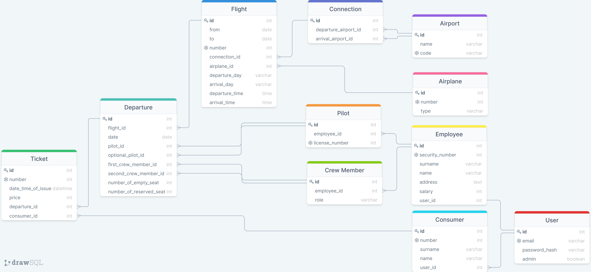

# airline-company-app

Work done for Centrale Lyon, MOD 4.6 Database system

Airline Company Website is up and running at *[http://35.180.199.50/](http://35.180.199.50)*, if the app is not running, please contact me (via Messenger, mail, or pull request).

# Architecture

## Frontend `src/`

### Single-page application

The project is build with the [React](https://reactjs.org) library.

It is a simple-page application with state variable. That means that, once your on the page, you never reload, or load, another page on the same domain, everything is self contained.

When you click a link (*or, more precisely, what looks like a link*), you change the state of the app (hold in the `appState` variable).

`src/App.js`
```js
// ...
<>
<Header
isConnected={user.isConnected}
isAdmin={user.isAdmin}
homeState={() => changeAppState('home')}
signInState={() => changeAppState('signin')}
profileState={() => changeAppState('profile')}
adminState={() => changeAppState('admin')}
/>
{appState === 'home' && <Home flightsState={() => changeAppState('flights')}/>}
{appState === 'flights' && <Flights checkoutState={() => changeAppState('checkout')}/>}
{appState === 'checkout' && <Checkout completionState={() => changeAppState('completion')}/>}
{appState === 'completion' && <Completion homeState={() => changeAppState('home')}/>}
{appState === 'signin' && <SignIn previousState={() => changeAppState(previousAppState)}/>}
{appState === 'profile' && <Profile previousState={() => changeAppState(previousAppState)} checkoutState={() => changeAppState('checkout')}/>}
{appState === 'admin' && <Admin/>}
<Footer />
</>
// ...
```

### Connection with the database

The application use an external **API** to retrieve and edit information in the database.

The main advandage is that this **API** can be distributed on any platform, not related to the platform that distrubutes the application.

> Here, for cost efficiency reason, both the **API** and the application are served by the same server, but this hasn't to be the case. Indeed, for a more secure and reliable application, it would have been more appropriate to distribute the application with **Serverless** (*AWS Lambda*) platform and to distribute the **API** with either a instance connected to a SQL Database or another **Serverless** environement connected to a SQL environement (*AWS RDS*).

One of the exemple of the numerous call made to the **API** is the call made to retrieve the available flights. This call is made in `src/hoooks/useFlights.js`.

```js
// ...
const url = (fromAirport, toAirport, date) => (
  `${apiendpoint}/flights/airports/${fromAirport}-${toAirport}/date/${date.valueOf()}`
);

const fetchAPI = async(fromAirport, toAirport, date) => {
  const response = await fetch(url(fromAirport, toAirport, date));
  return await response.json();
};
// ...
function loadFlights() {
    // Fetch API
    let isMounted = true;
    fetchAPI(fromAirport, toAirport, date).then(responseJSON => {
      if (!isMounted) {
        return;
      }
      const data = {}
      responseJSON.forEach(flight => {
        data[flight.id] = {
          id: flight.id,
          from: flight.from,
          to: flight.to,
          departure: new Date(flight.departure),
          arrival: new Date(flight.arrival),
          price: flight.price,
        };
      });
      setFlights(data);
    });

    return () => {
      isMounted = false;
    }; 
  }
// ...
```

Here, in development, **API** is reached on something like *`http://127.0.0.1/flights/airports/10-13`* with `10` and `13` the `id` of the airports chosen by the user.

Have a look at `src/hooks/useAirports.js` to see how the *airports* are retrieved.

### Authentification

Authentification is handle in `src/hooks/useUser.js` `signIn` function.

```js
  async function signIn(email, password) {
    // Hash password
    const passwordHash = createHash('sha256').update(password).digest('hex');
    // Ask for token
    const responseJSON = await fetch(apiendpoint + '/signin', {
      method: 'POST',
      headers: {
          'Content-Type': 'application/json',
      },
      body: JSON.stringify({
          email: email,
          passwordHash: passwordHash,
      }),
    }).then(response => response.json());

    if (responseJSON && responseJSON.status === 'connected') {
      user.isConnected = true;
      user.token = responseJSON.token;
      user.isAdmin = responseJSON.isAdmin;
      user.email = email;
      user.password = password;
      setIsConnected(user.isConnected);
    } else {
      signOut()
    }
  }
```

Frontend request signin to the backend by sending the email and the hash of the password to the dedicated endpoint.

> The password is never sent over the network, this would be a security leak. A even more secure approach would have implied salt and pepper before hashing.

If backend recognizes the user, it send a `status` flag to `connected`. So, frontend can hold in a local variable the current status of the user, and most importantly, its **[JWT Token](https://jwt.io)** (`user.token`).

**JWT Token** is a key sent by the server to authenticate the user in subsequent request. Frontend will send this token along side other information to be able to perform operations related to a given account, or operations that needs special rights (*admin* status needed to update the database).

### Admin panel

The admin panel let user authenticated as *admin* to create, update, and delete objects in the database. This implies that the user has the appropriate **JWT Token** to perform the action.

The code source for the admin panel is located at `src/components/admin/`.

There are three forms, one to create objects (`AdminCreateForm` at `src/components/admin/admin-create-form.js`), on to update existing objects (`AdminUpdateForm` at `src/components/admin/admin-update-form.js`), and one to delete objects `AdminDeleteForm` at `src/components/admin/admin-delete-form.js`.

These forms are created thanks to a **JSON** template `databaseSchema` at `src/components/admin/database-schema.js`.

```js
{
        ...,
        'name-of-an-object': {
                'fields': [
                        ...,
                        ['name-of-a-field', 'type-of-this-field'],
                        ['name-of-a-external key field', '$name-of-this-external-key-object$field-to-display-a.field-to-display-b.etc.']
                        ...,
                ]
        }
        ...,
}
```

This allow you to update the **UI**, and the database schema, withtout having to change the code.

## Backend `backend/mysql-server/`

Backend is a simple **[Express](https://expressjs.com)** server.

In development, the server is used purely as an **API**. In production, the root endpoint is reserved to serve the application, the rest remains the **API**.

**[MySQL Community Server](https://dev.mysql.com/downloads/mysql/)** must be up and running for the **API** to work.

Most of the code needed to run the server is at `backend/mysql-server/app.js`.

The folder `backend/mysql-server/commands` contains useful commands to create and delete the database. It should be use only at the beginning and at the end of the life of the project.

### Connect to the database

The package **[mysql](https://www.npmjs.com/package/mysql)** is used to connect to the database running instance.

```js
// Connection to SQL Database
const mysql = require('mysql');
const {connect, end,  query} = require('./helpers/mysql-helpers');
const { env } = require('process');
const connection = mysql.createConnection({
    host: process.env.DB_HOST,
    user: process.env.DB_USER,
    password: process.env.DB_PASSWORD,
    database: process.env.DB_NAME,
});
connect(connection);
```

Three helpers are defined in `backend/mysql-server/helpers/mysql-helpers.js` to transform `callback` functions into `async` functions.

> These are useful to avoid sending result before getting result in asynchronous operations. Indeed, `express` `use` method need a return statement that cannot be completed with a `callback` (or with intrigated workaround).

The information to connect to the database is stored in `backend/mysql-server/.env`. This file is never sent to the GitHub Repository and need to be created when cloning the repository (it handles sensitive information).

### Get information from the database

All the endpoint paths that only involve to retrieve information used the **GET** method.

For exemple, the endpoint to retrieve the flights corresponding to a given date and a given correspondance is `/flights/airports/:from-:to/date/:date` (word starting with `:` are parameters, see [Express documentation](https://expressjs.com/en/guide/routing.html)).

```js
app.get('/flights/airports/:from-:to/date/:date', async (req, res) => {
    // ...
    // Read parameters and check that everything is correct
    // ...

    // Request to database 
    console.log(flight.from, flight.to)
    const date = new Date(parseInt(dateInt));
    const sqlQuery = `
    SELECT departure.date, flight.departure_time, flight.arrival_time, a_departure.name as name_departure, a_arrival.name as name_arrival
    FROM departure
    LEFT JOIN flight ON departure.flight_id = flight.id
    LEFT JOIN connection ON flight.connection_id = connection.id
    LEFT JOIN airport a_departure ON connection.departure_airport_id = a_departure.id
    LEFT JOIN airport a_arrival ON connection.arrival_airport_id = a_arrival.id
    WHERE DATE(departure.date) = ? AND a_departure.id = ? AND a_arrival.id = ?
    ORDER BY departure.date ASC
    `;
    const result = await query(connection, sqlQuery, [date.toJSON().slice(0, 10), flight.from, flight.to])
    console.log('Result Search Flights');
    console.log(result);

    // Map the result to correct type
    // ...

    // DEV, for test only
    // Add a fake response to always have something to click on
    // ...
    res.status(200); 
    res.json(data);
    return;
});
```

### Authentification

Each endpoint that modified the database is a **POST** method endpoint. Before processing the request, the server check the **[JWT Token](https://jwt.io)** send in the request. If the token doesn't have the `admin` flag, it rejects the request.

The **JWT Token** is generated by the server in the `/signin` endpoint, thanks to the **[jsonwebtoken](https://www.npmjs.com/package/jsonwebtoken)** package.

```js
app.post('/signin', async (req, res) => {
        const {email, passwordHash} = req.body;

        // Check if the user exist
        const sqlQuery = `
        SELECT admin
        FROM user
        WHERE email = ? AND password_hash = ?
        `;
        const result = await query(connection, sqlQuery, [email, passwordHash]);
        console.log('Result Search User');

        // If it does, create a token
        if (result.length > 0) {
        const user = result[0];
        const token = jwt.sign({ role: user.admin ? 'admin' : '' }, process.env.HASH_SECRET);
        res.json({status:'connected', token: token, isAdmin: user.admin ? true : false});
        } else { // If not, inform the client
        res.json({status:'not connected'});
        }

});
```

`process.env.HASH_SECRET` is stored in `backend/mysql-server/.env`. This file is never sent to GitHub Repository because it handles sensitive data. Without this secret, the client cannot modify its token.
By default, `jsonwebtoken` use `SHA256` encryption which is secure enough for our purpose (you won't succeed to modify your token with bruteforce only).  

# Install development server

## Get the GitHub Repository

1. Clone the Github repository and install dependencies
```bash
git clone https://github.com/AdrKacz/airline-company-app.git
cd airline-company-app
```

## Install your MySQL Database

2. Install **[MySQL](https://dev.mysql.com/downloads/mysql/)**

3. Follow the instruction to install **MySQL**, and start your database (*it should already be done by default*)

4. Install **[MySQL Workbench](https://dev.mysql.com/downloads/workbench/)**

5. Open **MySQL Workbench** and connect to your running database

6. Alter the *root* user to be able to connect to it in code
```sql
ALTER USER 'root'@'localhost' IDENTIFIED WITH mysql_native_password BY 'your_password_here';
FLUSH PRIVILEGES;
```

6. Copy your *username* and *password* in a `backend/mysql-server/.env` file
```
DB_HOST=localhost
DB_USER=<your root user>
DB_PASSWORD=<your root password>
DB_NAME=airlineapp
HASH_SECRET=<your hash secret, choose anything you want>
MODE=DEV
```

7. Go to **MySQL Workbench** and create your database
```sql
CREATE DATABASE airlineapp;
```

8. Go to your terminal and initiate your database
```bash
cd backend/mysql-server
npm install
node commands/initiate.js
```

9. Go to **MySQL Workbench** and create your first admin user
```sql
USE airlineapp;
INSERT INTO user (email, password_hash, admin)
VALUES (<admin email>, <admin hashed password>, true);
```

To find your hashed password, go to [SHA256 Online](https://emn178.github.io/online-tools/sha256.html), enter your password in *Input*, and copy the result from *Output*.

## Run Front and Back Servers

10. Update the API endpoint to your local one in `src/constants.js`.
```js
// Only choose one
// DEV
exports.apiendpoint = 'http://127.0.0.1:8080';
// PROD
// exports.apiendpoint = <production endpoint, don't care for now>;
```

11. Run both your *MySQL API server* and your *React server*
```bash
yarn install
yarn start
```
And in another terminal window :
```bash
cd backend/mysql-server
npm install
npm start
```

12. Go to [http://localhost:3000](http://localhost:3000), and edit your code in `src/` (*react, frontend*) or `mysql-server` (*express api, backend*) to see live updates.

13. On your browser, hit `Ctrl-R` to reload page and reset the state of your app.

14. On your terminals, hit `Ctrl-C` to stop your local servers.

# Install production server (using AWS EC2)

## Create your Cloud Instance

1. Go to [AWS EC2](https://eu-west-3.console.aws.amazon.com/ec2/) and create a new instance.

 - Select *Ubuntu*, last version
 - Keep all other setting to default
 - In the *firewall section*, update **SSH** to allow only *My IP*, and add **HTTP** and allow *anywhere*
 - Review and launch
 - Connect to your instance using the *Connect* button and its instructions

## Install your MySQL Database

2. Install **MySQL** on your instance
```bash
sudo apt update
sudo apt install mysql-server
```

3. Check the status of your running database
```bash
sudo systemctl status mysql
```
You should see something like the following :
```bash
● mysql.service - MySQL Community Server
     Loaded: loaded (/lib/systemd/system/mysql.service; enabled; vendor preset: enabled)
     Active: active (running) since ... ....-..-.. ..:..:.. UTC; 1min 38s ago
   Main PID: 2390 (mysqld)
     Status: "Server is operational"
      Tasks: 37 (limit: 1154)
     Memory: 350.3M
     CGroup: /system.slice/mysql.service
             └─2390 /usr/sbin/mysqld

... .. ..:..:.. ip-...-...-...-... systemd[1]: Starting MySQL Community Server...
... .. ..:..:.. ip-...-...-...-... systemd[1]: Started MySQL Community Server.
```

4. Log in your database and alter the *root* user, choose your own password and remember it
```bash
sudo mysql
```

```sql
ALTER USER 'root'@'localhost' IDENTIFIED WITH mysql_native_password BY 'your_password_here';
FLUSH PRIVILEGES;
exit
```

5. Login with your updated credentials and create your database
```bash
sudo mysql -u root -p
```

```sql
CREATE DATABASE airlineapp;
exit
```

6. Clone this Git Repository
```bash
git clone https://github.com/AdrKacz/airline-company-app.git
cd airline-company-app
```

7. Install NPM
```
sudo apt install npm
```

8. Create `backend/mysql-server/.env`
```bash
nano backend/mysql-server/.env
```

```
DB_HOST=localhost
DB_USER=<your root user>
DB_PASSWORD=<your root password>
DB_NAME=airlineapp
HASH_SECRET=<your hash secret, choose anything you want>
MODE=PROD
```

*Exemple*
```
DB_HOST=localhost
DB_USER=root
DB_PASSWORD=password
DB_NAME=airlineapp
HASH_SECRET=secret
```

9. Initiate your database
```bash
cd backend/mysql-server
npm install
node commands/initiate.js
```

10. Create admin user
```bash
sudo mysql -u root -p
```

```sql
USE airlineapp;
INSERT INTO user (email, password_hash, admin)
VALUES (<admin email>, <admin hashed password>, true);
```

*Exemples*
```sql
USE airlineapp;
INSERT INTO user (email, password_hash, admin)
VALUES ('admin@admin', '8c6976e5b5410415bde908bd4dee15dfb167a9c873fc4bb8a81f6f2ab448a918', true);
exit
```

To find your hashed password, go to [SHA256 Online](https://emn178.github.io/online-tools/sha256.html), enter your password in *Input*, and copy the result from *Output*.

## Open your Instance to the World

11. Create your NGINX server and run it
```
sudo wget http://nginx.org/keys/nginx_signing.key
sudo apt-key add nginx_signing.key
cd /etc/apt
```

Add the following lines to the end of `sources.list`
```
deb http://nginx.org/packages/ubuntu focal nginx
deb-src http://nginx.org/packages/ubuntu focal nginx
```

```
sudo apt-get update
sudo apt-get install nginx
sudo systemctl start nginx.service
sudo systemctl status nginx.service
```

You should see something like:
```
● nginx.service - nginx - high performance web server
     Loaded: loaded (/lib/systemd/system/nginx.service; enabled; vendor preset: enabled)
     Active: active (running) since ... ....-..-.. ..:..:.. UTC; 5s ago
       Docs: https://nginx.org/en/docs/
    Process: 13785 ExecStart=/usr/sbin/nginx -c /etc/nginx/nginx.conf (code=exited, status=0/SUCCESS)
   Main PID: 13786 (nginx)
      Tasks: 2 (limit: 1154)
     Memory: 1.7M
     CGroup: /system.slice/nginx.service
             ├─13786 nginx: master process /usr/sbin/nginx -c /etc/nginx/nginx.conf
             └─13787 nginx: worker process

... .. ..:..:.. ip-...-...-...-... systemd[1]: Starting nginx - high performance web server...
... .. ..:..:.. ip-...-...-...-... systemd[1]: Started nginx - high performance web server.
```

12. Go to [AWS EC2](https://eu-west-3.console.aws.amazon.com/ec2/), select your instance and copy its *Public IP* and in your browser go to *`http://<your instance ip>/airline`*. You should see a webpage with **Welcome to nginx!** on it.

13. Update `airline-company-app/src/constants.js` to update your instance ip
```bash
cd && nano airline-company-app/src/constants.js
```

```
// Only choose one
// DEV
// exports.apiendpoint = 'http://127.0.0.1:8080';
// PROD
exports.apiendpoint = 'http://<your ip address>';
```

Now build the source to take into account your modification.
```bash
cd && cd airline-company-app
# npm install could take a long time if your instance doesn't have a lot of memory
# alternatively, you can execute yarn build-server on your dev environment on your machine
# and then scp (copy via ssh) the build repo in your cloud instance
npm install
npm run build-server
```

14. Create a `.conf` file for NGINX
```bash
cd /etc/nginx/conf.d
sudo mv default.conf default.conf.bak
sudo nano airline.conf
```

And type the following

```
server {
        location / {
                proxy_pass http://localhost:8080;
        }
}
```

```bash
sudo nginx -s reload
```

## Run your server

15. Install **tmux** and run your server
```bash
cd
sudo apt install tmux
```

> Into **tmux**, use `Ctrl-b "` to split window, `Ctrl-b Arrow` to change window, and `Ctrl-b d` to detach your session. Then, type `tmux attach-session -t 0` to recover your session.

Open tmux and run the server.

```bash
cd
cd airline-company-app/
tmux # this will open tmux
cd backend/mysql-server
npm install
npm run prod
```

Hit `Ctrl-b d` to detach your session.

Your site is up and running at *`http://<your instance ip>/airline`*.

Exit your cloud instance.

```bash
exit # (or Ctrl-d)
```

# Database

Explore the database schema in [DrawSQL Airline Company App](https://drawsql.app/ecl/diagrams/airline-company-app).



---

# Getting Started with Create React App (*not needed*)

This project was bootstrapped with [Create React App](https://github.com/facebook/create-react-app).

## Available Scripts

In the project directory, you can run:

### `yarn start`

Runs the app in the development mode.\
Open [http://localhost:3000](http://localhost:3000) to view it in the browser.

The page will reload if you make edits.\
You will also see any lint errors in the console.

### `yarn test`

Launches the test runner in the interactive watch mode.\
See the section about [running tests](https://facebook.github.io/create-react-app/docs/running-tests) for more information.

### `yarn build`

Builds the app for production to the `build` folder.\
It correctly bundles React in production mode and optimizes the build for the best performance.

The build is minified and the filenames include the hashes.\
Your app is ready to be deployed!

See the section about [deployment](https://facebook.github.io/create-react-app/docs/deployment) for more information.

### `yarn eject`

**Note: this is a one-way operation. Once you `eject`, you can’t go back!**

If you aren’t satisfied with the build tool and configuration choices, you can `eject` at any time. This command will remove the single build dependency from your project.

Instead, it will copy all the configuration files and the transitive dependencies (webpack, Babel, ESLint, etc) right into your project so you have full control over them. All of the commands except `eject` will still work, but they will point to the copied scripts so you can tweak them. At this point you’re on your own.

You don’t have to ever use `eject`. The curated feature set is suitable for small and middle deployments, and you shouldn’t feel obligated to use this feature. However we understand that this tool wouldn’t be useful if you couldn’t customize it when you are ready for it.

## Learn More

You can learn more in the [Create React App documentation](https://facebook.github.io/create-react-app/docs/getting-started).

To learn React, check out the [React documentation](https://reactjs.org/).

### Code Splitting

This section has moved here: [https://facebook.github.io/create-react-app/docs/code-splitting](https://facebook.github.io/create-react-app/docs/code-splitting)

### Analyzing the Bundle Size

This section has moved here: [https://facebook.github.io/create-react-app/docs/analyzing-the-bundle-size](https://facebook.github.io/create-react-app/docs/analyzing-the-bundle-size)

### Making a Progressive Web App

This section has moved here: [https://facebook.github.io/create-react-app/docs/making-a-progressive-web-app](https://facebook.github.io/create-react-app/docs/making-a-progressive-web-app)

### Advanced Configuration

This section has moved here: [https://facebook.github.io/create-react-app/docs/advanced-configuration](https://facebook.github.io/create-react-app/docs/advanced-configuration)

### Deployment

This section has moved here: [https://facebook.github.io/create-react-app/docs/deployment](https://facebook.github.io/create-react-app/docs/deployment)

### `yarn build` fails to minify

This section has moved here: [https://facebook.github.io/create-react-app/docs/troubleshooting#npm-run-build-fails-to-minify](https://facebook.github.io/create-react-app/docs/troubleshooting#npm-run-build-fails-to-minify)
